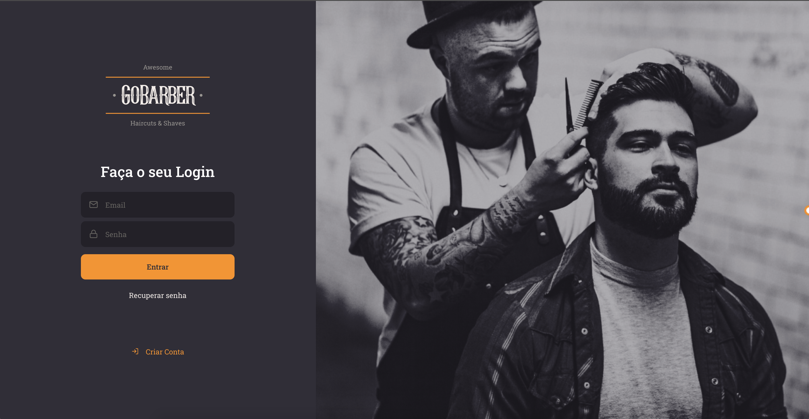
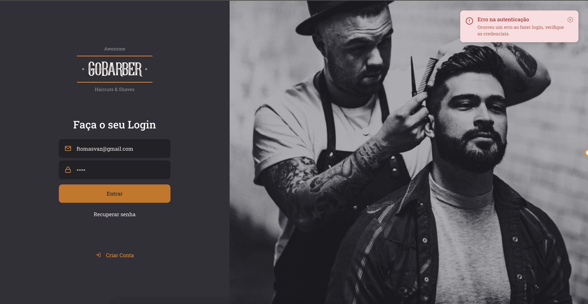
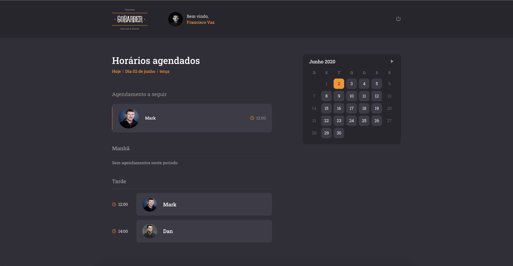
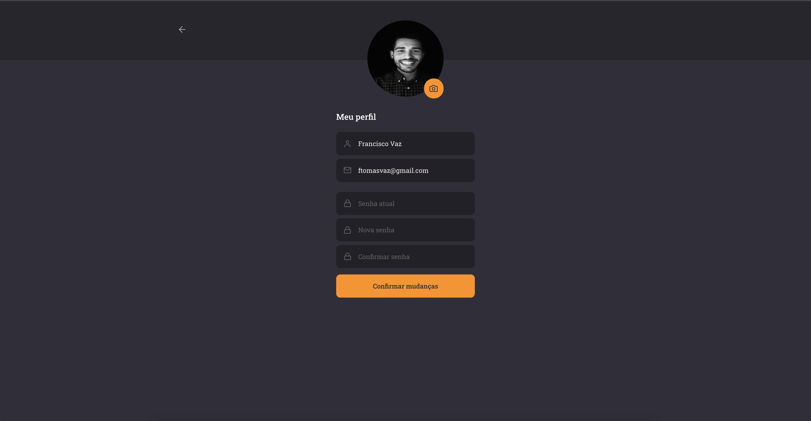

<h1 align="center">
  
</h1>

<h3 align="center">
  ReactJS Application - GoBarber
</h3>

<p align="center">
  <a href="#%EF%B8%8F-about-the-project">About the project</a>&nbsp;&nbsp;&nbsp;|&nbsp;&nbsp;&nbsp;
  <a href="#-demo">Demo</a>&nbsp;&nbsp;&nbsp;|&nbsp;&nbsp;&nbsp;
  <a href="#-preview">Preview</a>&nbsp;&nbsp;&nbsp;|&nbsp;&nbsp;&nbsp;
  <a href="#-technologies">Technologies</a>&nbsp;&nbsp;&nbsp;|&nbsp;&nbsp;&nbsp;
  <a href="#-getting-started">Getting started</a>&nbsp;&nbsp;&nbsp;|&nbsp;&nbsp;&nbsp;
  <a href="#-license">License</a>
</p>

</br>

## 💇🏻‍♂️ About the project

This is the frontend to an app for a fictional beauty service provider, GoBarber.

This project is part of a complete application involving backend, frontend and mobile:

**Backend**, click here: [GoBarber Rest API](https://github.com/franciscovaz/gobarber-backend-nodejs)</br>
**Mobile**: Comming soon

## 📸 Demo


<br />

## 📸 Preview








## 🚀 Technologies

- [ReactJS](https://reactjs.org/)
- [TypeScript](https://www.typescriptlang.org/)
- [React Router DOM](https://reacttraining.com/react-router/)
- [React Icons](https://react-icons.netlify.com/#/)
- [UnForm](https://unform.dev/)
- [Yup](https://github.com/jquense/yup)
- [Styled Components](https://styled-components.com/)
- [Polished](https://github.com/styled-components/polished)
- [Axios](https://github.com/axios/axios)
- [Eslint](https://eslint.org/)
- [Prettier](https://prettier.io/)
- [EditorConfig](https://editorconfig.org/)

## 💻 Getting started

### Requirements

- Backend project [API](https://github.com/franciscovaz/gobarber-backend-nodejs) running

**Clone the project and access the folder**

```bash
$ git clone https://github.com/franciscovaz/gobarber-backend-nodejs.git
```

```bash
$ cd gobarber-web
```

**Follow the steps below**

```bash
# Install the dependencies
$ yarn

# In 'src/services/api.ts' set your backend API IP

# Start the client
$ yarn start
```

---

Made with 💜 by Francisco Vaz 👋 [See my linkedin](https://www.linkedin.com/in/francisco-vaz/)
